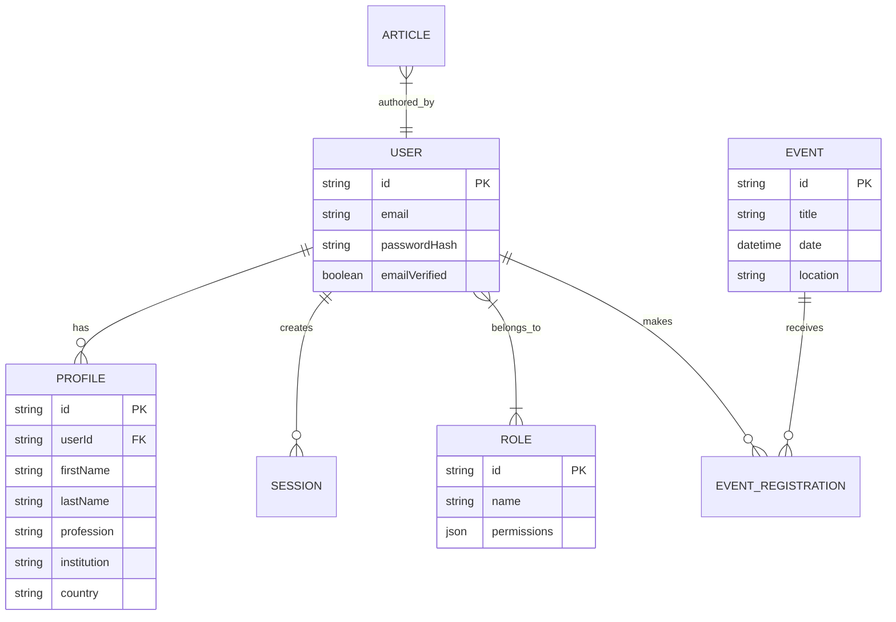

# AABP Platform - Phase 0 Architecture & Foundation

## 1. Information Architecture (Sitemap)

```mermaid
graph TD
    Root[AABP Platform]
    Root --> Public[Public Pages]
    Root --> Auth[Authentication]
    Root --> MemberPortal[Member Dashboard]
    Root --> Admin[Admin Panel]
    
    Public --> Home[/]
    Public --> About[/about]
    Public --> Research[/research]
    Public --> Events[/events]
    Public --> Career[/career]
    Public --> Media[/media]
    
    About --> Mission[/about/mission]
    About --> History[/about/history]
    About --> Leadership[/about/leadership]
    
    Research --> Projects[/research/projects]
    Research --> Publications[/research/publications]
    
    MemberPortal --> Profile[/dashboard/profile]
    MemberPortal --> Network[/dashboard/network]
    MemberPortal --> MyEvents[/dashboard/events]
```

## 2. Route Map (Next.js App Router)
```text
src/app
├── (public)
│   ├── page.tsx (Home)
│   ├── about/
│   ├── research/
│   ├── events/
│   ├── career/
│   └── media/
├── (auth)
│   ├── login/
│   ├── register/
│   └── reset-password/
├── (dashboard)
│   ├── layout.tsx
│   ├── dashboard/
│   └── profile/
├── (admin)
│   ├── layout.tsx
│   ├── admin/
│   │   ├── members/
│   │   ├── events/
│   │   ├── research/
│   │   ├── career/
│   │   └── cms/
└── api
    ├── upload/
    └── ai/
```

## 3. Database ER Diagram


## 4. Permission Matrix (RBAC)
| Resource | Guest | Member | Editor | Admin | Super Admin |
|----------|-------|--------|--------|-------|-------------|
| Public Pages | Read | Read | Read | Read | Read/Write |
| Member Directory| No | Read | Read | Read/Write | Read/Write |
| Events | Read | Register| Manage | Manage| Manage |
| News/Media | Read | Read | Write | Manage| Manage |
| System Settings| No | No | No | No | Manage |

## 5. Design Token System
- **Colors**:
  - Primary: Deep Navy (`#0A192F`)
  - Secondary: Soft Gray (`#F3F4F6`)
  - Accent: Gold (`#D4AF37`)
  - Action/Error: British Red (`#C8102E`)
- **Spacing System** (Tailwind based): Base `4px` (1) scale up to `128px` (32).
- **Typography**: Inter (Sans) and Merriweather (Serif).
- **Elevation System**: Subtler soft shadows `shadow-sm`, `shadow-md` for cards, `shadow-lg` for dropdowns/modals.

## 6. Folder Structure
```text
src/
├── app/                  # Route definitions
├── components/           # Reusable UI components
│   ├── ui/               # Base shadcn/ui components
│   ├── layout/           # Headers, footers, containers
│   └── shared/           # Business logic components
├── motion/               # Framer motion presets (fade.ts, slide.ts)
├── lib/                  # Utilities, DB, AI interfaces
├── hooks/                # React custom hooks
├── server/               # Server actions & API handlers
├── types/                # TS definitions
└── styles/               # Global CSS, design tokens
```

## 7. Component Inventory
**Base:** Button, Input, Select, Dialog, Card, Avatar, Badge, Skeleton, Toast, Tooltip.
**Complex:** Hero, Timeline, Search Palette, Mega Menu, Statistics Card, DataTable.

## 8. SEO & Content Strategy
- **i18n**: `en`, `az`, `ru` supported on all routes (`/[lang]/path`).
- **Metadata**: Dynamic open-graph, JSON-LD schema (Organization, Event) per page.
- **Content**: Admin CMS-driven approach for all dynamic content (News, Events, Partners).
